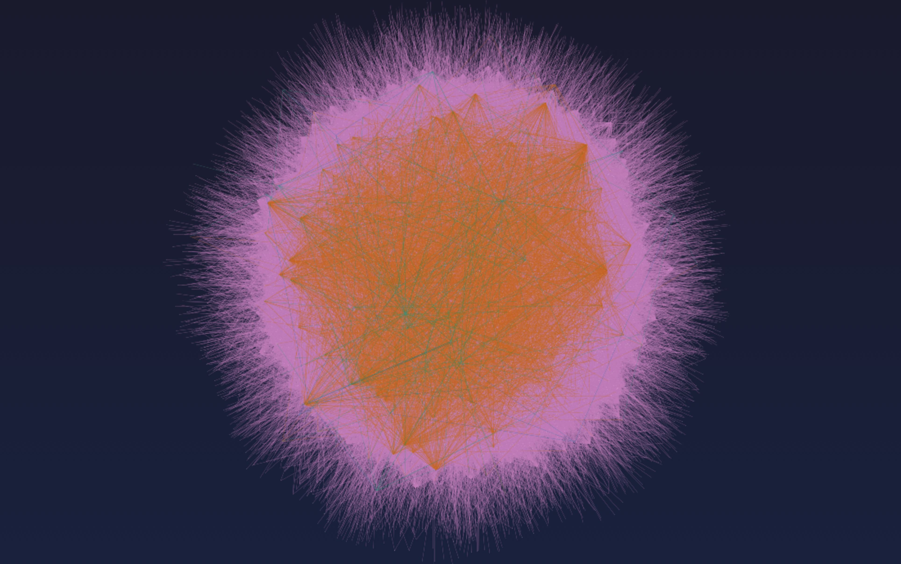

<p align="center">
  <picture>
    <source media="(prefers-color-scheme: dark)" srcset="assets/images/logo-dark-mode.png">
    <source media="(prefers-color-scheme: light)" srcset="assets/images/logo-light-mode.png">
    
  </picture>
</p>

# MLKN.lab — Multi-Layered Knowledge Network Ideas Laboratory

<!-- BADGES -->
[](https://doi.org/10.5281/zenodo.21363227)
[](https://opensource.org/licenses/MIT)
[](https://www.python.org/)
[](https://openalex.org)
[](#)
[](https://francoispapin.github.io/MLKN-lab/)
[](https://github.com/FrancoisPapin/MLKN-lab)

<!-- NAVBAR (No title needed above this line) -->
<p align="center">
  <a href="https://francoispapin.github.io/MLKN-lab/"><b>[ Main Website ]</b></a> &nbsp;•&nbsp;
  <a href="https://francoispapin.github.io/MLKN-lab/research/research.html"><b>[ Research ]</b></a> &nbsp;•&nbsp;
  <a href="https://francoispapin.github.io/MLKN-lab/knowledge_network/MLKN-hypergraph.html"><b>[ Interactive Visualization ]</b></a> &nbsp;•&nbsp;
  <a href="https://francoispapin.github.io/MLKN-lab/polyhierarchy/polyhierarchy.html"><b>[ Data Structure ]</b></a> &nbsp;•&nbsp;
  <a href="https://francoispapin.github.io/MLKN-lab/data/data.html"><b>[ Data & API ]</b></a> &nbsp;•&nbsp;
</p>

---

<!-- 4. IMAGE PREVIEW (HERO BANNER) -->
<p align="center">
  <a href="https://francoispapin.github.io/MLKN-lab/knowledge_network/MLKN-hypergraph.html">
    
  </a>
  <br>
  <em>Figure 1: Interactive MLKN.hypergraph mapping knowledge topology across 25 disciplines and 5 ontological layers.</em> 
  <br>
    <em>Click the image to launch the live interactive map.</em>
</p>

---

<!-- TABLE OF CONTENTS (Has a title inside <summary>) -->
<details open>
  <summary><b>Table of Contents</b></summary>
  <ol>
    <li><a href="#overview">Overview</a></li>
    <li><a href="#key-statistics">Key Statistics</a></li>
    <li><a href="#key-features">Key Features</a></li>
    <li><a href="#repository-structure">Repository Structure</a></li>
    <li><a href="#getting-started">Getting Started & Quick Start</a></li>
    <li><a href="#dataset-overview">Dataset Overview</a></li>
    <li><a href="#use-cases">Use Cases</a></li>
    <li><a href="#scientific-references">Scientific References</a></li>
    <li><a href="#open-access-monographs">Open Access Monographs</a></li>
    <li><a href="#contribution">Contribution</a></li>
    <li><a href="#contribution">Collaboration</a></li>
    <li><a href="#contact">Contact</a></li>
    <li><a href="#contribution">License</a></li>
    <li><a href="#related-resources">Related Resources</a></li>
  </ol>
</details>

---

## **Overview**

**MLKN.lab** (*Multi-Layered Knowledge Network Ideas Laboratory*) is a **computational metascience platform** that maps the **structural topology of human knowledge** through a **polyhierarchical, data-driven framework**. It models scientific knowledge as a **dynamic, multi-layered hypergraph**, revealing hidden structures, bridges, and gaps across disciplines.

### 🔹 Why It Matters
Traditional flat classifications (e.g., OpenAlex’s 4 domains) **miss critical interdisciplinary connections**. Our **6-core-domain polyhierarchy** captures **emergent structures** in science, enabling:
- **Discovery** of hidden knowledge bridges (e.g., how "Transformers" diffused from AI to Neuroscience).
- **Validation** of metascience hypotheses (e.g., ARI benchmarking).
- **Augmentation** of human and AI reasoning (e.g., interactive knowledge maps).

### 🔹 Ontology
Built from **bibliometric analysis of large-scale scholarly metadata** (OpenAlex), MLKN.lab operationalizes a **polyhierarchy** across:
- **5 Ontological Layers** (Core Domains → Concepts).
- **6 Epistemological Core Domains** (Formal Sciences, Natural Sciences, Engineering & Technology, Life Sciences, Health & Medical Sciences, Social Sciences & Humanities).
- **25 Academic Disciplines** (e.g., Computer Science, Neuroscience).
- **235 Subdisciplines** (e.g., AI, Cognitive Psychology).
- **320K+ Interdisciplinary Connections**.

### 🔹 Dimensions
MLKN.lab serves as:
- **Research Platform**: A living laboratory for testing hypotheses about the evolution of science.
- **Scientific Instrument**: A high-precision tool for graph-theoretic analysis of knowledge networks.
- **Cognitive Interface**: A generative system to augment human reasoning through interactive knowledge maps.

---

## **Keywords**

**Core Paradigms & Domains**
- `metascience` · `science of science` · `computational epistemology` · `network science` · `systems science` · `interdisciplinary research` · `cognitive science` · `human-machine interaction` · `human-ai interaction` · `semantic web` · `collective intelligence` · `unified theory of knowledge`

**Network Science & Complex Systems**:
- `network science` · `complex systems` · `graph topology` · `multilayer networks` · `hypergraphs` · `knowledge network` · `polyhierarchy` · `knowledge graph`

**Methods & Dynamics**:
- `research mapping` · `knowledge diffusion` · `data science` · `data visualization` · `scientometrics` · `bibliometrics` 

**Ontology & Knowledge Organization**:
- `ontology` · `taxonomy` · `knowledge organization systems` · `SKOS` · `Frascati Classification` · `OpenAlex`

**Interaction & Open Science Foundations**:
- `human-machine interaction` · `human-ai interaction` · `open science` · `open source` · `open data` · `open education` · `FAIR principles`

---

## **Key Statistics**
- **326,862 rows** (CSV)
- **31,590 nodes** (JSON)
- **320,075 edges** (JSON)
- **5 Ontological Layers**
- **6 Core Domains**
- **25 Academic Disciplines**
- **235 Subdisciplines**

---

## **Key Features**

### **1. Polyhierarchical Framework**
- **5 Ontological Layers**: Core Domains → Academic Disciplines → Subdisciplines → Core Thematic Domains → Main Concepts.
- **6 Core Domains**: Formal Sciences, Natural Sciences, Engineering & Technology, Life Sciences, Health & Medical Sciences, Social Sciences & Humanities.
- **Reclassified Ontology**: Extends OpenAlex’s 4-domain taxonomy to **6 domains** for **balanced representation** and **interdisciplinarity**.

### **2. Knowledge Networks**
- **Interdisciplinary Knowledge Network**: Visualize all 25 disciplines simultaneously, organized into 6 Core Domains.
- **25 Disciplinary Knowledge Networks**: Explore individual discipline networks (e.g., Computer Science, Neuroscience, Psychology).
- **Interactive Visualizations**: Powered by **D3.js** and **NetworkX** for dynamic exploration.

### **3. Data & Methodology**
- **Data Source**: OpenAlex (March 2026 snapshot).
- **Classification Logic**: Aligns with **OECD Frascati Manual** and **UNESCO Fields of Science**.
- **Validation**: Network metrics (centrality, modularity) and expert review ensure accuracy.

### **4. Applications**
- **For Researchers**: Uncover hidden connections, identify emerging fields, and test meta-science hypotheses.
- **For Educators**: Design interdisciplinary curricula and adaptive learning paths.
- **For Policymakers**: Inform science policy by visualizing gaps, silos, and opportunities.
- **For AI Developers**: Enhance AI reasoning with structured knowledge networks.

### **5. Why MLKN.lab Stands Out**
```
 | Feature                 | MLKN.lab                          | Traditional Approaches           |
 |-------------------------|-----------------------------------|----------------------------------|
 | **Hierarchy**           | 5 ontological layers              | Flat or 2–3 layers               |
 | **Interdisciplinarity** | 6 balanced core domains           | Biased toward STEM               |
 | **Validation**          | ARI benchmarking + expert review  | Manual classification only       |
 | **Visualization**       | Interactive D3.js hypergraphs     | Static or limited to 2D networks |
```
 
---

## **Repository Structure**
```
MLKN-lab/
│
├── index.html                       # Homepage
│
├── research/                        # Research
│   ├── research.html                # Research focus
│   ├── model.html                   # MLKN.model
│   ├── model-mathematical-foundations.html   # MLKN.model - Mathematical Foundations
│   └── method.html                  # Method
│
├── knowledge_network/               # Knowledge network visualizations
│   ├── polyhierarchy.html           # Polyhierarchy
│   ├── MLKN-hypergraph.html         # Interactive hypergraph
│   └── data.html                    # Data
│
├── knowledge_library/               # Bibliography and monographs
│   ├── references.html              # Scientific references
│   └── open-access-monographs.html  # Open-access monographs
│   └── normative-references.html    # Normative references
│
├── applications/                    # Applications
│   ├── applications.html            # General applications
│   └── essay.html                   # Essays & explorations
│   └── normative-applications.html  # Normative applications
│
├── about/                           # About
│   ├── about.html                   # About MLKN.lab
│   └── inspirations.html            # Inspirations
│   └── normative-foundations.html   # Normative foundations
│
├── data/                            # Datasets
│   ├── MLKN_Hierarchy_Master_File_All_layers_All_Details_Final.csv  # Master hierarchy (92.9 MB)
│   ├── MLKN_hypergraph_nodes.json   # Nodes for visualization (5.6 MB)
│   └── MLKN_hypergraph_edges.json   # Edges for visualization (40.5 MB)
│
├── tutorials/                       # Jupyter notebooks
│   └── MLKN_tutorial.ipynb          # Quickstart guide [](https://colab.research.google.com/github/FrancoisPapin/MLKN-lab/blob/main/tutorials/MLKN_tutorial.ipynb)
│
├── css/                             # Stylesheets
│   └── style.css                    # Main styles
│
├── citation/                        # Citation
│   └── CITATION.cff                 # Cite as
│
└── README.md                        # This file
```

---

## **Getting Started**

### **Prerequisites**
- **Python 3.x** (for data analysis)
- **Jupyter Notebook** (for tutorials)
- **D3.js** (for interactive visualizations)

### **Installation**
1. Clone the repository:
   ```bash
   git clone https://github.com/FrancoisPapin/MLKN-lab.git
   cd MLKN-lab
   ```
2. Install dependencies:
   ```bash
   pip install pandas networkx matplotlib
   ```

### **Quick Start**
- Load the **master hierarchy CSV** into a DataFrame:
  ```python
  import pandas as pd
  df = pd.read_csv("data/MLKN_Hierarchy_Master_File_All_layers_All_Details_Final.csv")
  print(df.head())
  ```
- Visualize the **hypergraph** using the provided JSON files:
  ```python
  import json
  with open("data/MLKN_hypergraph_nodes.json") as f:
      nodes = json.load(f)
  with open("data/MLKN_hypergraph_edges.json") as f:
      edges = json.load(f)
  ```
- Explore the MLKN dataset interactively in your browser without local installation:
[](https://colab.research.google.com/github/FrancoisPapin/MLKN-lab/blob/main/tutorials/MLKN_tutorial.ipynb)

---

## **Dataset Overview**
```
| **File**                                                      | **Format** | **Size**   | **Purpose**                           |
|---------------------------------------------------------------|------------|------------|---------------------------------------|
| `MLKN_Hierarchy_Master_File_All_layers_All_Details_Final.csv` | CSV        | 92.9 MB    | Master hierarchy for analysis         |
| `MLKN_hypergraph_nodes.json`                                  | JSON       | 5.6 MB     | Nodes for interactive visualization   |
| `MLKN_hypergraph_edges.json`                                  | JSON       | 40.5 MB    | Edges for interactive visualization   |
| `MLKN_tutorial.ipynb`                                         | Jupyter    | 534 Bytes  | Quickstart guide                      |
```
---

## **Use Cases**

### **1. Metascience Research**
- Analyze **interdisciplinarity, knowledge diffusion, or the evolution of scientific fields**.
- Example: Track how concepts like *"Transformers"* diffuse from AI to neuroscience.

### **2. Computational Epistemology**
- Model **how knowledge is structured, validated, and evolved** in computational systems.
- Develop **AI systems** that reason over scientific knowledge.

### **3. Network Analysis**
- Study the **topological structure** of scientific knowledge using **NetworkX** or **Gephi**.
- Identify **key disciplines, bridges between fields, or emerging research areas**.

### **4. Interactive Visualization**
- Explore the **[MLKN.hypergraph](https://francoispapin.github.io/MLKN-lab/knowledge_network/MLKN-hypergraph.html)**.
- Build **custom network explorers** for specific research questions.

---
## **Scientific References**
MLKN.lab is grounded in **meta-science, computational epistemology, network theory, and cognitive science**. Explore **100+ scientific references** that foundation MLKN.lab, including:
#### Metascience
- Fortunato, S., et al. (2018). *Science of Science*. **Science**.
- Börner, K. (2015). *Atlas of science: Visualizing what we know*. **MIT Press**.
#### Computational Epistemology
- Thagard, P. (2019). *How to Collaborate: A Computational Model of Scientific Knowledge Integration*. **Philosophical Explorations**.
- Zenil, H., et al. (2020). *A computational epistemology of science*. **Synthese**.
#### Network Theory
- Barabási, A.-L., & Albert, R. (1999). *Emergence of Scaling in Random Networks*. **Science**.
- Boccaletti, S., et al. (2014). *The Structure and Dynamics of Multilayer Networks*. **Physics Reports**.
#### Cognitive Science
- Anderson, J. R., & Lebiere, C. (1998). *The atomic components of thought*. **Psychological Review**.
- Langley, P., Laird, J. E., & Rogers, S. (2009). *Cognitive Systems: Human Cognition as a Basis for the Design of Intelligent Systems*. **MIT Press**.

🔗 **[Full Scientific References](https://francoispapin.github.io/MLKN-lab/references/references.html)**

---
## **Open Access Monographs**
Explore **200+ open-access monographs** that inspire MLKN.lab, including:
- Seibt, J., Hakli, R., & Nørskov, M. (Eds.). (2026). *Robophilosophy: Philosophy of, for, and by Social Robotics*. **MIT Press**.
- Chirimuuta, M. (Ed.). (2024). *The Brain Abstracted: Simplification in the History and Philosophy of Neuroscience*. **MIT Press**.
- Nersessian, N. J. (Ed.). (2022). *Interdisciplinarity in the Making: Models and Methods in Frontier Science*. **MIT Press**.

🔗 **[Full Open-Access Monographs Collection](https://francoispapin.github.io/MLKN-lab/monographs/monographs.html)**

---
## **Contribution**
We welcome contributions! Here’s how you can help:
1. **Report Issues**: Open an issue on GitHub for bugs or feature requests.
2. **Suggest Improvements**: Propose enhancements to the hierarchy or visualizations.
3. **Cite MLKN.lab**: If you use our website, please cite:
   ```
   Papin, F. (2026). MLKN.lab: A Polyhierarchical Framework for Modeling the Scientific Knowledge [Software]. https://francoispapin.github.io/MLKN-lab/
   ```
4. **Cite MLKN.lab Dataset**: If you use our data or tools, please cite:
   ```
   Papin, F. (2026). MLKN.lab: A Polyhierarchical Hypergraph of Scientific Knowledge for Metascience, Computational Epistemology, and Network Analysis [Dataset]. Zenodo. https://doi.org/10.5281/zenodo.21363227
   ```

---
## **Collaboration**
[](https://colab.research.google.com/github/FrancoisPapin/MLKN-lab/blob/main/tutorials/MLKN_tutorial.ipynb)
<p>The <strong>MLKN.lab</strong> project is an open-science initiative. We welcome contributions, feature requests, and domain ontology refinements!</p>
<ul>
<li><strong>Repository:</strong> <a href="https://github.com/francoispapin/MLKN-lab/" rel="noopener">https://github.com/francoispapin/MLKN-lab/</a></li>
<li><strong>Interactive Visualization:</strong> <a href="https://francoispapin.github.io/MLKN-lab/" rel="noopener">https://github.com/francoispapin/MLKN-lab/</a></li>
<li><strong>Get Involved:</strong> Open an issue or discussion on GitHub to collaborate on graph extensions, new mappings, or downstream applications.</li>
</ul>

---
## **Contact**
- **Author**: [François Papin](https://www.linkedin.com/in/francois-papin/)
- **Website**: [https://francoispapin.github.io/MLKN-lab/](https://francoispapin.github.io/MLKN-lab/)
- **GitHub**: [https://github.com/FrancoisPapin/MLKN-lab](https://github.com/FrancoisPapin/MLKN-lab)

---
## **License**
This project is licensed under the **MIT License** – see the [LICENSE](LICENSE) file for details.

---
## **Related Resources**
- **[MLKN.labV1](https://francoispapin.github.io/MLKN-labV1/)** (Previous experimental version)
- **[Zenodo Dataset](https://doi.org/10.5281/zenodo.21363227)** (DOI: [10.5281/zenodo.21363227](https://doi.org/10.5281/zenodo.21363227))
- **[OpenAlex](https://docs.openalex.org/)** (Data source)
- **[OECD Frascati Manual](https://www.oecd.org/en/publications/frascati-manual-2015_9789264239012-en.html)** (Classification standard)
